# JobBoard 


A production-grade, distributed recruitment platform designed to connect talents with opportunities. Built on a modern **Microservices Architecture** using **.NET 10 (Preview)**, implementing **Clean Architecture**, **Event-Driven** communication, and centralized access via **YARP Gateway**.

---

## 💡 Why This Project Matters

This project demonstrates how to design and implement a complex **Enterprise-level system** rather than just a simple CRUD application. It highlights:

* **Real-World Scalability:** Strict service isolation where each microservice owns its data and logic.
* **Event-Driven Consistency:** Using **RabbitMQ** to decouple services (e.g., separating user registration from email notifications) instead of tight coupling.
* **Advanced Authentication:** Full implementation of **JWT Access + Refresh Tokens** with sliding expiration, compliant with modern security standards.
* **Performance Optimization:** Strategic use of **Redis** for caching hot data (job listings) and managing distributed sessions.
* **Observability First:** Integrated **OpenTelemetry** and **Serilog** to trace requests across microservice boundaries, simulating a real DevOps environment.

---

## 🏗 System Architecture

The system uses the **API Gateway** pattern to offload cross-cutting concerns (SSL, Auth, Routing) from the microservices.

```mermaid
graph TD

  classDef bigText font-size:22px;

  subgraph Internal["Internal Network (Docker)"]
    style Internal stroke:#333,stroke-width:2px

    Client[Clients / Web UI] -->|HTTPS| Gateway[🌐 YARP Gateway]

    Gateway -->|Auth Routes| Identity[🆔 Identity Service]
    Gateway -->|Job Routes| Recruitment[👔 Recruitment Service]

    Identity -->|Write| DB1[(🐘 Identity DB)]
    Recruitment -->|Write| DB2[(🐘 Recruitment DB)]
    Recruitment -->|Read/Write| Cache[(🔴 Redis Cache)]

    Identity -.->|Pub: UserRegistered| Bus{🐰 RabbitMQ}
    Recruitment -.->|Pub: AppCreated| Bus

    Bus -->|Sub: Send Email| Worker[📧 Notification Worker]

    class Client,Gateway,Identity,Recruitment,DB1,DB2,Cache,Bus,Worker bigText
  end

```



### 🧩 Core User Flow

1. **Registration:** User registers via `/auth/register`. The **Identity** service saves the user and publishes a `UserRegisteredEvent` to the message bus.
2. **Async Notification:** The **Notification Worker** consumes the event and sends a welcome email immediately, without blocking the HTTP response.
3. **Authentication:** User logs in and receives a pair of **JWT** (Access) and **Refresh Token**.
4. **Discovery:** User browses job listings. The **Recruitment** service first checks **Redis**; If data is missing in cache, it fetches from PostgreSQL, it fetches from PostgreSQL and hydrates the cache.
5. **Application:** User applies for a job. **Recruitment** validates the user context via Gateway headers and publishes an `ApplicationCreatedEvent` for further processing.

---

## 🔐 Security & Reliability

* **Gateway Isolation:** Internal microservices (`Identity`, `Recruitment`) are not exposed to the public internet. All traffic is sanitized via **YARP**.
* **Token Management:** Secure implementation of **RefreshToken** flow to maintain user sessions without compromising security.
* **Resilience:** Implements retry policies (via **MassTransit**) for message broker connections and health checks for databases.
* **Structured Logging:** All services log structured JSON data via **Serilog** for easy querying and debugging.

---

## 🛠 Tech Stack

| Category | Technology | Usage |
| --- | --- | --- |
| **Framework** | **.NET 10 (Preview)** | High-performance backend runtime. |
| **Architecture** | **Clean Architecture** | Separation of Domain, Application, and Infrastructure layers. |
| **Gateway** | **YARP** | Reverse Proxy for routing and load balancing. |
| **Messaging** | **MassTransit (RabbitMQ)** | Asynchronous event bus. |
| **Database** | **PostgreSQL (EF Core)** | Relational data storage with optimizations (Indexes, Hard Delete). |
| **Caching** | **Redis** | Distributed caching & data protection keys. |
| **Validation** | **FluentValidation** | Strong-typed request validation pipeline. |
| **Logging** | **Serilog + OpenTelemetry** | Distributed tracing and centralized logging. |

---

## 🚀 Getting Started

### Prerequisites

* [Docker Desktop](https://www.docker.com/products/docker-desktop/)

### 1. Environment Setup

Create a `.env` file in the root directory (next to `docker-compose.yaml`):

```ini
# Postgres Settings
POSTGRES_USER=postgres
POSTGRES_PASSWORD=your_secure_password
POSTGRES_DB=jobboard_db

# RabbitMQ Settings
RABBITMQ_DEFAULT_USER=guest
RABBITMQ_DEFAULT_PASS=guest

# Security
JWT_SECRET=your_super_secret_key_must_be_at_least_32_chars_long
JWT_ISSUER=JobBoard
JWT_AUDIENCE=JobBoardClient

```

### 2. Run with Docker

Execute the following command to build and start the entire fleet (API + DB + Broker + Redis):

```bash
docker-compose up --build

```

### 3. Access

Once the containers are running:

* **Unified Swagger UI (Gateway):**
Open `https://localhost:5001/swagger` (Routes requests to all microservices).
* **RabbitMQ Management:**
Open `http://localhost:15672` (Login: `guest` / `guest`) to monitor queues and exchanges.
* **Health Checks:**
* Identity: `https://localhost:5001/api/v1/identity/health`
* Recruitment: `https://localhost:5001/api/v1/recruitment/health`


### 4. Stopping the Services

```bash
docker-compose down

```

---

## 📂 Project Structure

Each microservice follows the **Clean Architecture** strict layer separation:

```text
src/
├── Gateways/
│   └── JobBoard.Gateway/         # Entry point (YARP)
├── Services/
│   ├── Identity/                 # Auth, Users, Refresh Tokens
│   │   ├── Domain/               # Entities, Enums, Interfaces
│   │   ├── Application/          # Use Cases, Validators, Mappers
│   │   ├── Infrastructure/       # EF Core, Repositories, Migrations
│   │   └── Api/                  # Controllers, Endpoints
│   ├── Recruitment/              # Jobs, Applications Logic
│   └── Notification/             # Background Worker (Consumes RabbitMQ events)
└── Shared/                       # Shared DTOs, Exceptions, Behaviors

```
## ⚖️ Trade-offs

- Eventual consistency instead of distributed transactions
- Increased operational complexity in exchange for scalability

## 📜 License

This project is licensed under the MIT License.
